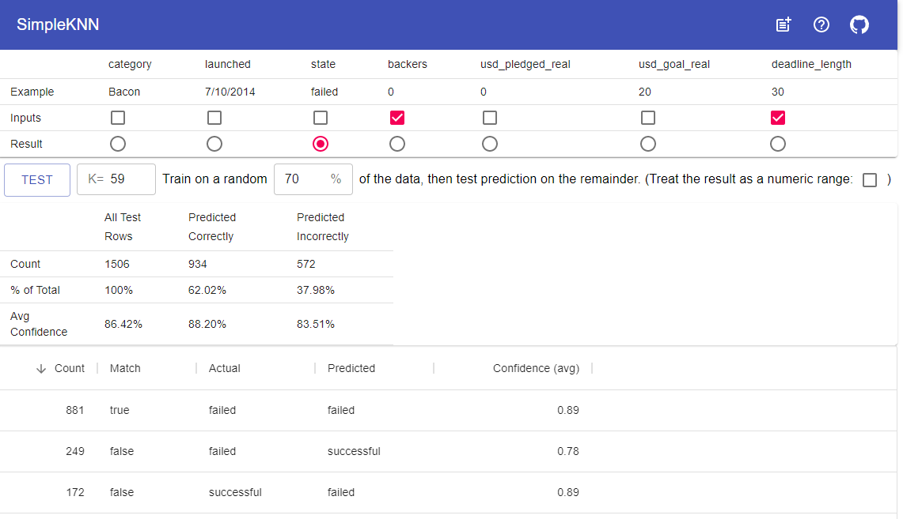

# SimpleKNN

SimpleKNN is a GUI over the [ML5.js](https://ml5js.org/) KNN Classifier

SimpleKNN allows you to experiment with the [K-Nearest Neighbors](https://en.wikipedia.org/wiki/K-nearest_neighbors_algorithm) machine learning algorithm using your existing CSV data sets.
- KNN classifies a new value based on the closest training examples (the nearest neighbors).
- This tool is built using the KNNClassifier of the [ML5.js](https://ml5js.org/) library
- All processing happens in your browser, the data you upload never leaves your computer.

I created this because I was curious if KNN would be an improvement over linear regression methods for some existing data sets I had.

## Installation

1. Clone this repository
2. Navigate to the folder
3. `npm install`
4. `npm start`
5. Open a browser to the specified localhost url

## Usage

Use the Add button in the header to upload a CSV data set.
- Note: This tool works up to a few thousand rows (which is all I needed). After that performance degrades rapidly.

A table will appear with the columns from the data set and three rows.
- The first row, Example, contains an example row from the data set
- In the second row, Inputs, you should select the columns that should be used to calculate the 'result'.  These must be numbers: Price, score, etc.
- In the third row, Result, you should select the column that is the 'result' for the row. It should be a discrete set: colors, letter grades, buy/sell/hold, etc.

When you have selected the columns you want, set the parameters you desire and click Test.
- K represents the number of neighbors to examine when predicting. Larger numbers have less noise, but higher computation times and increased bias from outliers.
- The percentage controls how much data is used for training examples, with the remainder used to validate the accuracy of the resulting model.

After the process runs, two tables are presented, for validation that was correctly and incorrectly predicted by the model.
- The Predicted Correctly table breaks down by result category, including row counts and the average confidence the model had in its prediction.
- The Predicted Incorrectly table breaks down actual and predicted result category, including row counts and the average confidence the model had in its prediction.

## Contributing

I'm not anticipating making further changes to this repository.

Feel free to fork and do what you will.

## License

[MIT](https://choosealicense.com/licenses/mit/)
